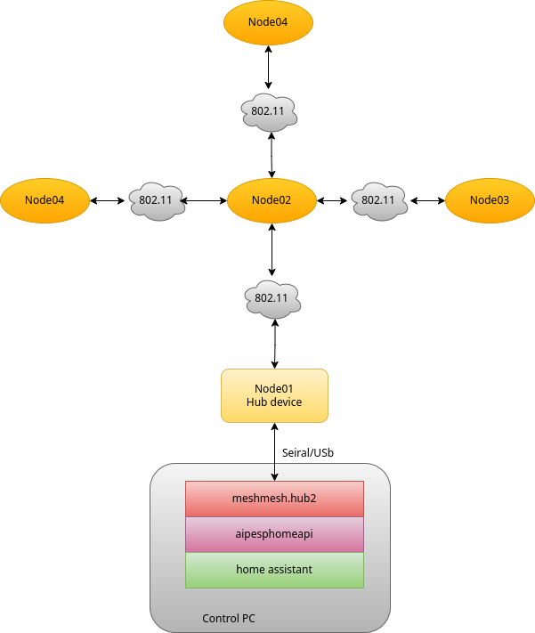
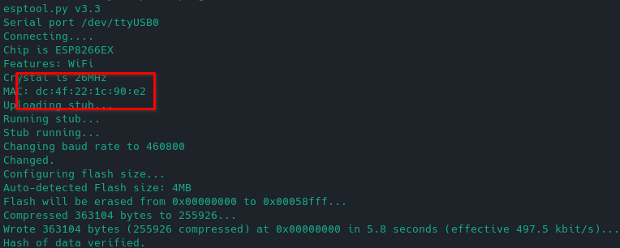
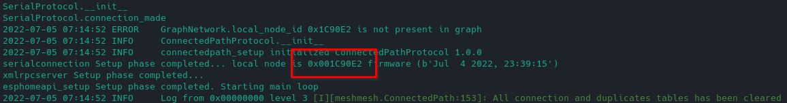
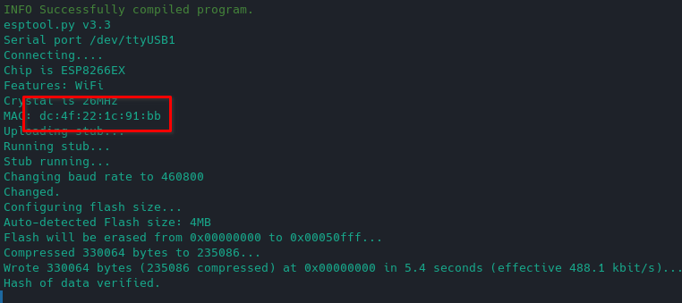
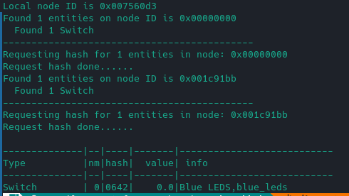

# MeshMeshHub


## Introduction

MeshMesh is a mesh network implementation for any esp8266 board.

1) Is based on the  [Esphome](https://github.com/esphome/esphome) firmware

2) It relies on raw 802.11 packets and does not require a wifi AP to  work 

3) The packets can make jumps on intermediate devices to extend the  range of the network. 

4) There is not limit on number of nodes. 

5) Beacons are not required to maintain active the connections (less  electromagnetic pollution)

6) Compatible with the Esphome api component 

7) Compatible with [Home assistant](https://github.com/home-assistant)  trough a modified [Aioesphomeapi](https://github.com/esphome/aioesphomeapi) library 

8) It require a single [Esphome](https://github.com/esphome/esphome) device that act as [hub](https://github.com/EspMeshMesh/meshmeshhub) (like zigbee for  example) 

9) The topology of the network is dynamic and can be changed easily 9) 

10) Only the Esp8266 is supported for now. I'm trying to implement the  same logic on a esp32 but the task is far from be finished. 

11) is not based on the Espressif mesh implementation.

The following image show a brief structure of the mesh network.



## Preparation

```sh
WORKSPACE=<your meshmesh workspace folder>
WORKSPACE=<your meshmesh workspace folder>

```

Clone the following projects:

```shell
git clone https://github.com/EspMeshMesh/esphome.git -b mm_2022.4.0
git clone https://github.com/EspMeshMesh/meshmeshhub.git
git clone https://github.com/EspMeshMesh/aioesphomeapi.git
```

```shell
cd ${WORKSPACE}/esphome
python -m venv venv
source venv/bin/activate
pip install -r requirements.txt
```

```shell
cd ${WORKSPACE}/meshmeshhub
python -m venv venv
source venv/bin/activate
pip install -r requirements.txt
```


## Tutorial 1: Local node test

### Load firmware on HUB node

This tutorial is focused on flash and test the HUB node device.

Enter in the esphome project folder:

```shell
cd ${WORKSPACE}/esphome
```

Connect the **first** device (d1 mini or nodemcu) to the usb (/dev/ttyUSB0) port 
and flash the **node01** configuration.

```shell
python -m esphome run --device /dev/ttyUSB0  ../meshmeshhub/configs/node01.yaml 
```

Keep note of device mac address provided by the esptool: The network address inside the network will be equal to the last three bytes of the device mac address.



### Connect the python HUB software to the HUB node

```shell
cd ${WORKSPACE}/meshmeshhub
venv/bin/python -m meshmesh.hub2 -p unicast  -sp /dev/ttyUSB0 -br 460800 -eg 
```



If you see something similar the above picture and the last three bytes of the mac address in the HUB software are  the same you see in after the esptool flash the step has been successful and the HUB software is correctly speaking with the HUB device.

## Tutorial 2: Test the HUB device with the test software

*For this tutorial you must have a running HUB software (follow the Tutorial 1 in order to have a running HUB software connected with the HUB device).*

To be continued...

## Tutorial 3: Flash and test a second node

*For this tutorial you must have a running HUB software (follow the Tutorial 1 in order to have a running HUB software connected with the HUB device).*

Enter in the esphome project folder:

```shell
cd ${WORKSPACE}/esphome
```

Connect the **second** device (d1 mini or nodemcu) to the usb port (let's suppose that his serial port is /dev/ttyUSB1)  and flash the **node02** configuration.

```shell
python -m esphome run --device /dev/ttyUSB1  ../meshmeshhub/configs/node02.yaml 
```

Keep note of device mac address provided by the esptool: The network address inside the network will be equal to the last three bytes of the device mac address.



Check if the second node is working correctly, in the following command use the mac address of the second device obtained after the firmware upload.

```shell
cd ${WORKSPACE}/meshmeshhub
source venv/bin/activate
PYTHONPATH=$PWD python meshmesh/hub2/test.py --read-entities 0x1C91BB 
```



If you see a similar screen the second node is working correctly.

## Tutorial 4: Automated node discovery


## Application icon attribution

[Mesh Icon # 79620](https://icon-library.com/icon/mesh-icon-16.html.html) 
